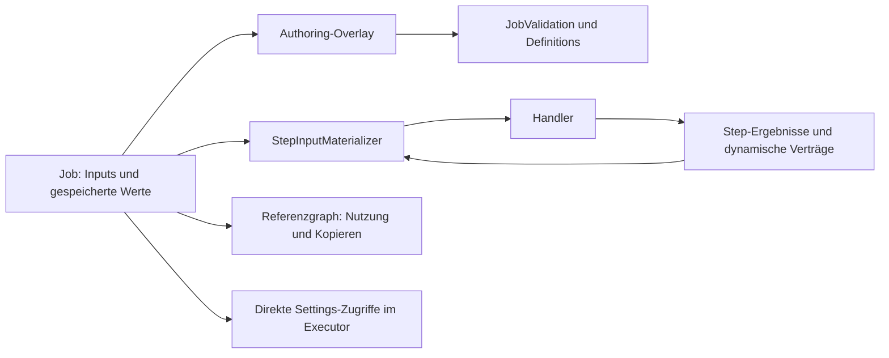

# Audit: Step-Properties, Variablen und Ausführung

Nachtrag: Die Befunde dieses Ausgangsberichts wurden repariert. Der
[Reparaturbericht mit Regressionen und offenen Produktentscheidungen](step-values-repair-2026-10-01.md)
beschreibt den aktuellen Stand. Die folgenden Reproduktionen dokumentieren den Zustand vor der Reparatur.

Stand: 2026-10-01, aktueller Arbeitsbaum einschließlich der noch nicht committeten Enum-,
Persistenz- und Layoutänderungen. Dies ist ein Befundbericht, keine neue Architekturentscheidung
und keine Umsetzung der empfohlenen Reparaturen.

## Ergebnis und Umfang

Es bestehen weiterhin konkurrierende Regeln und bestätigte Verhaltensfehler. Besonders betroffen
sind Referenzen innerhalb gespeicherter zusammengesetzter Werte, Kopieren von Steps, verborgene
Felder und Zugriffe auf nicht materialisierte Settings. Das frühere Konformitätsregister vom
2026-09-28 belegt keinen fehlerfreien aktuellen Wertepfad.

Geprüft wurden alle 39 registrierten Step-Definitionen mit 141 Feldern, darunter 19 Felder mit
Sichtbarkeitsbedingungen, sowie die zugehörigen Input-Verträge, Ergebnisregistrierungen und
Handler. Hinzu kommen Job-/Step-Serialisierung, Migration, lokale Werte, Jobvariablen,
zusammengesetzte Bindings, Property-Pfade, dynamische Enum-Verträge, Conditions,
Editorprojektionen, Verwendungszählung, Bereinigung, Kopieren und die Ausführungsvorbereitung.
Die vollständige Feld-/Ergebnisinventur steht in
[step-values-catalog-2026-10-01.json](step-values-catalog-2026-10-01.json).
Ergebnisproperties in dieser Inventur stammen aus dem jeweiligen Default-Step; dynamische
Windows-Abfragen benötigen zusätzlich ihre konkrete Capability. Deren Auswahl und
Vertragsauflösung wurden im Code geprüft, nicht durch Ausführen sämtlicher Windows-Abfragen.

13 Befunde sind unten priorisiert. Ein **reproduzierter** Befund besitzt ein isoliertes
ausgeführtes Beispiel; **Codebeleg** bezeichnet einen nachvollzogenen Produktionspfad ohne
vollständigen UI-/Betriebssystemdurchlauf. Die Probeergebnisse stehen in
[step-values-evidence-2026-10-01.json](step-values-evidence-2026-10-01.json).
Ein grüner bestehender Testlauf bedeutet nicht, dass die dokumentierten Lücken abgedeckt sind.

## Soll-Invarianten und bestehende Zuständigkeiten

1. Eine Referenz wird durch Provider, Source-ID und optionalen Property-Pfad eindeutig bestimmt.
   Autorisierung der Quellenart, Typ, Kardinalität und Enum-Identität gelten in Editor,
   Authoring-Validierung und Runtime gleich.
2. Der Referenzgraph umfasst `Inputs`, zusammengesetzte Bindings und Referenzen innerhalb
   gespeicherter lokaler JSON-Werte. Ein tatsächlich verwendeter Wert darf weder gelöscht noch
   als unbenutzt angeboten werden.
3. Kopieren eines Step-Teilgraphen erzeugt einen unabhängigen Teilgraphen. Interne Step- und
   LocalValue-Referenzen sowie stepgebundene Enum-Identitäten werden gemeinsam umgeschrieben;
   externe Referenzen bleiben erhalten.
4. Unbekannte Tokens und ungültige Werte bleiben für die Korrektur sichtbar. Öffnen eines
   Editors darf sie nicht durch gültig wirkende Standardwerte ersetzen.
5. Feldaktivität wird aus der wirksamen Konfiguration bestimmt. Ob inaktive Werte erhalten,
   geprüft oder aufgelöst werden, muss eine gemeinsame explizite Regel sein.
6. Jede Ausführungsentscheidung verwendet die wirksamen Eingaben. Persistierte `Settings`
   dürfen nach einem `Inputs`-Roundtrip nicht als bereits aufgelöste Konfiguration gelten.
7. Collection- und Object-Schemas prüfen sowohl Container als auch Elemente und verschachtelte
   Quellen. Metadaten und aufgelöster Wert beschreiben dieselbe Form.

Die vorhandenen kanonischen Eigentümer sind `StepDefinition`/`StepDescriptorDraftValidator`
für Feldregeln, `StepInputContractRegistry` für erlaubte Eingabeformen, `StepEnumRules` für
geschlossene Tokens, `StepResultMetadata`/`StepResultContractRegistry` für Ergebnisse,
`ConditionRules`/`JobValidation` für Bedingungen und Abhängigkeiten sowie
`JobStepsSnapshotService` für Snapshots. Die unten beschriebenen Erweiterungen gehören in
`TaskAutomation` beziehungsweise dessen neutrale Verträge, nicht in neue WPF-Sonderregeln.



Der Graphzweig `G` ist derzeit unvollständig; `D` umgeht die Eingabeauflösung. `A` und `M`
implementieren zusammengesetztes Einsetzen unterschiedlich.

## Befunde

### STEP-AUDIT-001 · P1 · Referenzgraph übersieht gespeicherte Conditions

**Reproduziert:** Eine gültige If-Bedingung verweist auf eine boolesche Jobvariable. Nach Migration
und Serialisierungs-Roundtrip liefert `FindLogical` **0 statt 1** Verwendung. Bei einer
Enum-Bedingung bleibt auch der lokale Vergleichswert unentdeckt.

`ValueReferenceUsageInspector.Find(Job)` beginnt ausschließlich bei den Step-Objekten. Es liest
weder `Job.LocalValues.Value` noch darin serialisierte Binding-Strukturen. Bei modernen Jobdateien
lässt `JobJsonSerialization` die Settings weg; die Condition liegt dann ausschließlich im lokalen
JSON-Wert. `GeneratedConditionEditorViewModel` liefert diese Conditions als Wert, ohne die
verschachtelten Referenzen über `IGeneratedCompositeInputEditor` in den Input-Baum zu exportieren.

`JobStepsViewModel.CleanupUnusedStepValues` verwendet denselben unvollständigen Inspector und
entfernt dadurch noch verwendete lokale Vergleichswerte. Verwendungsanzeige und Löschprüfung
übersehen Jobvariablen. Auch Migration und Secret-Vorbereitung verwenden den Inspector;
deren vollständige Folgen sind vom jeweiligen erlaubten eingebetteten Binding abhängig.

**Belege:** `TaskAutomation/Jobs/ValueReferenceUsageInspector.cs:10`,
`TaskAutomation/Jobs/JobJsonSerialization.cs:17`,
`DesktopAutomationApp/ViewModels/Jobs/GeneratedStepEditorViewModel.cs:1409`,
`DesktopAutomationApp/ViewModels/Jobs/JobStepsViewModel.cs:1289`,
`TaskAutomation/Jobs/JobExecutor.cs:1817`.

**Reparaturziel:** Gemeinsamer schemafähiger Referenzgraph im Backend. Zählen, Löschen,
Bereinigen, Migration und Kopieren müssen denselben Graphen verwenden. Keine zweite
Conditions-Sonderzählung in der UI. **Tests:** Contract-Roundtrip plus UI-/Integrationsfall
„Enum-Vergleich speichern, öffnen, bereinigen, erneut speichern“; lokale Vergleichsquelle bleibt
erhalten und eine genutzte Jobvariable wird als genutzt erkannt.

### STEP-AUDIT-002 · P1 · Duplizierte Auswahl-/If-Steps bleiben mit dem Original verbunden

**Reproduziert:** `UserChoice + If + EndIf` werden nach einem Persistenz-Roundtrip mit neuen IDs
geklont und durch den produktiven `RemapClonedReferences`-Pfad bearbeitet. Die neue If-Bedingung
verweist weiterhin auf die **Original-ID** des UserChoice-Steps. Der lokale Enum-Vergleichswert
ist nicht im Clipboard enthalten.

Das Backend klont nur Step-Objekte und ersetzt deren IDs. Die UI implementiert danach einen
zweiten Teil der Clone-Semantik: Erkennen von Referenzen, Kopieren lokaler Werte und Remapping.
Dabei werden eingebettete Condition-Referenzen und `EnumTypeName = UserChoiceResult:<StepId>`
nicht bearbeitet. Außerdem wird pro gefundenem lokalen Binding ein eigener Wert erzeugt;
eine konsistente Abbildung alter auf neue LocalValue-IDs fehlt.

**Belege:** `TaskAutomation/Jobs/JobStepsSnapshotService.cs:38`,
`DesktopAutomationApp/ViewModels/Jobs/JobStepsViewModel.cs:2522`, `:2561`, `:2593`.

**Reparaturziel:** Backend-Operation zum Klonen des vollständigen Teilgraphen mit einer
Step-ID-/LocalValue-ID-/Enum-ID-Abbildung. Voraussetzung: STEP-AUDIT-001.
**Tests:** Contract-Klonen eines Auswahl-/If-Blocks mit internen und externen Referenzen;
UI-Duplizieren, anschließend Original entfernen und geklonten Block ausführen.

### STEP-AUDIT-003 · P1 · Authoring verwechselt LocalValue und JobVariable

**Reproduziert:** Ein Timeout referenziert mit Provider `local_value` die ID einer ausschließlich
in `Job.Variables` vorhandenen Integer-Jobvariable. `ValidateJob` liefert **gültig**; die
Materialisierung scheitert mit „Die ausgewählte Jobvariable ist nicht verfügbar.“

Authoring führt beide Listen zusammen und sucht in `TryReadKnownValue`,
`ResolveProviderSource` und der Wertprüfung nur nach der GUID. Runtime besitzt hingegen
getrennte Provider-Registrierungen. Der Provider ist damit in der Validierung kein Bestandteil
der Identität, obwohl das Laufzeitmodell ihn voraussetzt.

**Belege:** `TaskAutomation/Jobs/JobValidation.cs:60`, `:215`, `:413`, `:686`,
`TaskAutomation/Steps/JobResultStore.cs:17`,
`TaskAutomation/Steps/RuntimeValueProviders.cs:58`.

**Reparaturziel:** Ein gemeinsamer Quellenkatalog mit Lookup über `(ProviderId, SourceId)`;
Overlay und Validierung verwenden dieselben Namensräume wie Runtime.
**Tests:** Contract-/Unit-Matrix für beide Provider, fehlende ID, IDs in beiden Listen und
falsche Quellenart. Bestehende Legacy-StepValue-Referenzen müssen explizit migriert werden.

### STEP-AUDIT-004 · P2 · Eindeutigkeit und Besitz gespeicherter Werte bleiben ungeprüft

**Reproduziert:** Zwei Jobvariablen mit derselben ID und Werten `10` und `99` werden akzeptiert;
die Runtime verwendet `99`. Authoring-Lookups lesen mit `FirstOrDefault`, Runtime-Registrierungen
verwenden `GroupBy(...).Last()`. Ein beschädigter/importierter Job kann daher mit einem anderen
Wert ausgeführt werden als dem geprüften.

`LocalValue.OwnerStepId` und `InputPath` beschreiben laut Modell einen Wert genau eines
Step-Inputs; `ValidateJob` prüft diese Besitzbeziehung nicht. Step-ID-Eindeutigkeit besitzt dort
ebenfalls keine globale Prüfung. Normale GUID-Erzeugung verhindert gewöhnliche Kollisionen,
ersetzt aber keine Prüfung persistierter/importierter Daten.

**Belege:** `TaskAutomation/Jobs/JobValidation.cs:60`, `:215`,
`TaskAutomation/Steps/RuntimeValueProviders.cs:64`,
`TaskAutomation/Steps/JobResultStore.cs:23`, `TaskAutomation/Jobs/JobVariable.cs:53`.

**Reparaturziel:** Backend-Prüfung globaler Identitäten und lokaler Besitzbeziehungen vor
stepbezogener Prüfung. Beschädigte Daten mit Diagnose erhalten; keine stille Neunummerierung.
**Tests:** Contract-Fälle für doppelte IDs, fehlende Besitzer und InputPath-Abweichungen.

### STEP-AUDIT-005 · P1 · Sichtbarkeit, Validierung und Apply entscheiden unterschiedlich

**Reproduziert:** FocusProcess mit Aktion `Minimize`, gültigem Prozessnamen und lokalem
`window_mode = RemovedMode` besteht `ValidateJob`. Runtime bricht beim Einlesen des für
`Minimize` ausgeblendeten WindowMode-Tokens ab.

`StepEditorActivity` startet mit allen Feldern und filtert nur ChoiceGroup-Zweige;
`VisibleWhen` entfernt normale Felder nicht. `StepDescriptorDraftValidator` und
`StepInputBindingReader` filtern danach zusätzlich sichtbar, `StepActiveFieldResolver`/
`StepInputMaterializer` dagegen nicht. `Apply` liest auch inaktive Enums streng.
Die UI implementiert `VisibleWhen`/`VisibleWhenAll` noch einmal selbst. Zudem berechnet die
Materialisierung Aktivität vor der Eingabeauflösung, während Authoring ein Overlay verwendet.
Diese Reihenfolge ist für zukünftige ChoiceGroups problematisch; keine aktuelle Built-in-
Definition verwendet solche Gruppen. Der geprüfte PointComparison-Modus-Roundtrip funktioniert.

**Belege:** `TaskAutomation.Contracts/Steps/StepEditorActivity.cs:13`,
`TaskAutomation/Steps/Definitions/StepDescriptorDraftValidator.cs:20`,
`TaskAutomation/Steps/Definitions/StepInputBindingReader.cs:15`,
`TaskAutomation/Steps/Definitions/StepActiveFieldResolver.cs:7`,
`TaskAutomation/Steps/StepInputMaterializer.cs:18`,
`TaskAutomation/Steps/Definitions/FocusProcessStepDefinition.cs:109`,
`DesktopAutomationApp/ViewModels/Jobs/GeneratedStepEditorViewModel.cs:342`.

**Reparaturziel:** Gemeinsame Feldaktivitätsregel mit explizitem Umgang mit unbekannten
Moduswerten und inaktiven Daten; Apply darf die gemeinsame Regel nicht nachträglich verletzen.
**Tests:** Modusmatrix für FocusProcess, StartProcess, PointComparison und FileSystemOperation;
inaktive ungültige Werte und ungültige Referenzen konsistent behandeln, Werte beim Wechsel erhalten.

### STEP-AUDIT-006 · P1 · Antwortlisten prüfen Länge, aber nicht zuverlässig die Elementform

**Reproduziert:** Ein UserChoice-Draft mit `options = [42,99]` liefert **keine ValidationIssue**.
`ApplyDraft` erzeugt daraus **0 Antworten**.

Der Descriptor prüft nur JsonArray und Mindestlänge. `ReadOptions` fängt den Fehler beim Lesen
der Elemente ab und liefert eine leere Liste. Die Custom-Validierung prüft `Any` und
Eindeutigkeit; für die leere Liste sind diese Prüfungen erfolgreich. Damit verdeckt die
Fallback-Liste den eigentlichen Deserialisierungsfehler.

**Belege:** `TaskAutomation/Steps/Definitions/UserChoiceStepDefinition.cs:23`, `:60`, `:70`,
`TaskAutomation/Steps/Definitions/StepDescriptorDraftValidator.cs:146`.

**Reparaturziel:** Schema-/Parse-Erfolg und Elementbedingungen gemeinsam validieren;
ungültige Elemente dürfen nicht durch eine leere erfolgreiche Projektion verschwinden.
**Tests:** Unit-/Contract-Matrix: Nicht-Objekte, null-Elemente, fehlende IDs/Labels, doppelte
IDs/Labels sowie gültige 2-/18-Element-Listen. Die Runtime muss dieselbe Form prüfen.

### STEP-AUDIT-007 · P1 · Zusammengesetzte Bindings haben eine ungeprüfte Collection-Kante

**Reproduziert:** Eine gültige UserChoice-Antwortliste bekommt in `Inputs.options.Items[0]`
eine Integer-Jobvariable als ganze Option. `ValidateJob` bleibt **gültig**;
Materialisierung liefert **0 Optionen ohne Ausnahme**.

`ValidateStructuredBinding` überspringt Items ohne eigene strukturierte Kinder. Provider-only
Items werden dadurch nicht gegen das erwartete Item-Schema geprüft. Für strukturierte Items
wird nur deren selbst angegebenes Schema geprüft, nicht dessen Gleichheit mit
`schema.ItemSchemaId`. Bei verschachtelten Membern fehlt ebenfalls eine Prüfung gegen
`expected.NestedSchemaId`. Member-Prüfung verwendet Metadaten, ohne stets den tatsächlich
gespeicherten verschachtelten Wert zu prüfen.

Zusätzlich setzt Authoring verschachtelte Werte ausschließlich in bestehende JSON-Pfade ein;
`ResolveNode` der Runtime erzeugt bei Bedarf neue Objekte, Properties, Arrays und Elemente.
Das sind zwei unterschiedliche Regeln für denselben Binding-Baum.

**Belege:** `TaskAutomation/Jobs/JobValidation.cs:486`, `:510`, `:529`,
`TaskAutomation/Jobs/ValueBindingTree.cs:155`,
`TaskAutomation/Steps/StepInputMaterializer.cs:99`,
`TaskAutomation/Steps/StepDraftValueOverlay.cs:7`.

**Reparaturziel:** Gemeinsame schemafähige Binding-Auflösung/Validierung. Item- und
NestedSchema-Verträge kommen vom Ziel, nicht von der Quelle. Authoring darf unaufgelöste
Runtime-Werte aufschieben, aber nicht deren erlaubte Struktur oder Provider ignorieren.
**Tests:** Contract-Matrix für UserChoiceOptions, PointEntries und VisualOverlayTextEntries;
Provider-only Items, falsche Item-/Member-Schemas und ungültige verschachtelte Werte.

### STEP-AUDIT-008 · P1 · Verschachtelte Enum-Editoren ersetzen unbekannte Tokens

**Reproduziert:** Öffnen eines AxisExpression-Editors mit `axis=X`, `operator=RemovedOperator`,
`value=17` und anschließendes `ToNode` schreibt `operator=LessThan`, ohne dass der Benutzer
den Operator korrigiert hat.

PointEntry.Source verwendet entsprechend `Manual` als Fallback, Camera.QualityMode
`Automatic`. Das sind eigenständige UI-Regeln entgegen `StepEnumRules` und der akzeptierten
Entscheidung über geschlossene, exakt geschriebene Tokens. `Enum.TryParse` allein akzeptiert
außerdem numerische Enum-Darstellungen; die strengen Backend-Leser erlauben nur benannte Tokens.

**Belege:** `DesktopAutomationApp/ViewModels/Jobs/GeneratedStepEditorViewModel.cs:1779`,
`:1824`, `:2535`, `TaskAutomation/Steps/Definitions/DefinitionValueReader.cs:27`,
`TaskAutomation/Steps/Definitions/StepEnumRules.cs:39`.

**Reparaturziel:** Unbekannten Originaltoken im Editor erhalten und ungültig anzeigen;
gemeinsame Tokenregeln auch für verschachtelte Felder verwenden.
**Tests:** UI-Roundtrip ohne Benutzeränderung für unbekannte, falsche Groß-/Kleinschreibung
und numerische Tokens in allen drei Editoren. Defaultwerte nur für neue Felder.

### STEP-AUDIT-009 · P1 · Variableneditor verändert ungültige Daten bereits beim Öffnen

**Reproduziert:** Eine Integer-Jobvariable mit gespeichertem Wert `"broken"` besitzt nach
Konstruktion von `JobVariableEditorViewModel` den Wert **0** im ursprünglichen Modell.

`LoadValue` ruft bei erfolglosem Lesen `SetDefaultValue` auf und lädt erneut. Das ersetzt
gespeicherte Daten, statt einen Fehlerzustand als Editorprojektion darzustellen. Die gleiche
Methode enthält eigene typbezogene Defaults, einschließlich `DateTime.Now`, Farbe und Geometrie.
UI-Draft-/Cancel-Semantik kann diesen Schaden bei späterem Öffnen einer Session nicht allgemein
beheben: Der Konstruktor erhält und verändert bereits das übergebene Modell.

**Belege:** `DesktopAutomationApp/ViewModels/Jobs/JobVariableEditorViewModel.cs:34`, `:292`,
`:313`, `:387`.

**Reparaturziel:** Nichtmutierende Anzeige ungültiger Werte; Backend besitzt Typprüfung und
Defaults für explizit neue Variablen. **Tests:** UI-Fälle öffnen/abbrechen ohne Datenänderung,
Integer/Text/Datum/Geometrie sowie explizites Korrigieren und Speichern.

### STEP-AUDIT-010 · P1 · Executor verwendet rohe Settings außerhalb der Materialisierung

**Reproduziert:** EndJob mit gespeichertem `skip_end_steps=true` wird korrekt validiert.
Nach Roundtrip steht im unbearbeiteten `Settings`-Objekt **false**, die Eingabeauflösung liefert
korrekt **true**. Der produktive EndJob-Pfad liest allerdings das unbearbeitete Objekt.

EndJob wird in Hauptphase und `ExecuteStepSequenceAsync` abgefangen, bevor `ExecuteStepAsync`
die Eingaben materialisiert. Dadurch kann „End-Steps überspringen“ nach Laden ignoriert werden.
VideoRecorder-Initialisierung liest ebenfalls rohe `videoStep.Settings.SavePath/FileName`
und `desktopDuplicationStep.Settings.DesktopIdx`. YOLO-Preload und -Unload lesen rohe
`Settings.Model`; der Handler liest später eine materialisierte Kopie. Das kann Vorladen
verhindern und insbesondere das Entladen des tatsächlich verwendeten Modells verfehlen.
Die Auswirkungen von Video-/YOLO-Pfaden sind hier Codebelege, keine durchgeführten Aufnahmen
oder Modell-Lifecycle-Experimente.

**Belege:** `TaskAutomation/Jobs/JobExecutor.cs:443`, `:449`, `:491`, `:561`, `:875`,
`:953`, `:1184`, `:1239`, `TaskAutomation/Jobs/JobJsonSerialization.cs:17`.

**Reparaturziel:** Steuerungsentscheidungen und Ressourcenplanung greifen auf einen gemeinsamen
wirksamen Konfigurationspfad zu. Später verfügbare Step-Ergebnisse müssen zeitgerecht aufgelöst
werden; nicht pauschal alle Werte beim Jobstart vorziehen. Modell-Unload verfolgt tatsächlich
geladene Ressourcen. **Tests:** Integration-/E2E-Roundtrip für EndJob in Start-/Hauptphase mit
End-Steps; gefälschter Recorder und YOLO-Manager für Pfad-/Monitor-/Modellplanung.

### STEP-AUDIT-011 · P2 · Kardinalität und Property-Typen widersprechen sich

**Reproduziert:** Für eine ResultObject-Variable `{ "scores": [1,2] }` beschreibt
`JobVariablePropertyMetadata` die Property `scores` als **Integer/Single**;
`ValueReferenceResolver` liefert für dieselbe Property **ResultObject/Collection**.
Eine Text/Collection-Variable `["a","b"]` wirft im Runtime-Leser eine JsonValue-Ausnahme.

Die JSON-Metadaten übernehmen für die Array-Property die Kardinalität des Elternobjekts.
Runtime-Typinferenz behandelt Arrays/Projektionen als ResultObject, ohne den Elementtyp
zu bestimmen. `JobVariableRuntimeValueReader` berücksichtigt Collection-Kardinalität nur
bei einigen zusammengesetzten Typen; primitive Typen werden immer skalar gelesen.
Nicht jede solche Sammlung lässt sich derzeit über den Variableneditor neu erzeugen;
persistierte Daten und Ergebnisprojektionen können sie dennoch enthalten.

**Belege:** `TaskAutomation/Steps/JobVariablePropertyMetadata.cs:70`, `:80`,
`TaskAutomation/Steps/ValueReferenceResolver.cs:103`, `:122`,
`TaskAutomation/Steps/RuntimeValueProviders.cs:120`.

**Reparaturziel:** Gemeinsamer Typ-/Kardinalitätsvertrag für Pfadauflösung, einschließlich
leerer und optionaler Collections. Nicht unterstützte Formen explizit ablehnen statt anders
beschreiben. **Tests:** Contract-Matrix für skalare Werte, Arrays, leere Arrays, Objektarrays
und Geometrieprojektionen wie Point/Collection.X.

### STEP-AUDIT-012 · P2 · Mehrere Ergebnisresolver tragen unterschiedliche Semantik

**Codebeleg:** `ValueReferenceResolver`, `ResultBindingResolver`,
`StepResultRuntimeValueProvider` und die Condition-Leser im `JobExecutor` implementieren
teilweise dieselbe Quellen-/Property-Auflösung. Sie unterscheiden sich bei ValuePath,
Typbeschreibung, Null-/Collection-Verhalten und dynamischen Ergebnisverträgen.

Der Condition-Leser nimmt Step-Ergebnisse vor dem allgemeinen Providerzweig und wendet dort
`binding.ValuePath` nicht an. Allgemeine StepResult-Provider beschreiben Properties aus dem
Runtime-Ergebnistyp, ohne `EnumTypeName`/`EnumValues` zu übertragen. Für UserChoice existiert
die stepabhängige Enum-Identität aber im konfigurierten Ergebnisvertrag. Der spezielle
Condition-Pfad erhält diese Identität über `conditionSources`; ihn blind durch den heutigen
allgemeinen Resolver zu ersetzen würde Verhalten verlieren.

Authoring kennt separate Quellen-Lookups und der StepResult-Zweig in
`ValidateConfiguredBinding` prüft die Form, aber nicht zusätzlich `AllowsProvider(step_result)`.
Ein ausprobierter UserChoice→FocusProcess.Action-Fall wird durch inkompatible Enum-Identität
korrekt abgewiesen; das ist **kein** reproduzierter Provider-Bypass. Die fehlende Policy-Prüfung
bleibt ein Codebefund für zukünftig/formgleich verfügbare Quellen.

**Belege:** `TaskAutomation/Steps/ValueReferenceResolver.cs:18`,
`TaskAutomation/Steps/ResultBindingResolver.cs:24`, `:142`, `:203`,
`TaskAutomation/Steps/RuntimeValueProviders.cs:166`,
`TaskAutomation/Jobs/JobExecutor.cs:1751`, `:1784`,
`TaskAutomation/Jobs/JobValidation.cs:447`.

**Reparaturziel:** Ein Resolver mit Zugang zum konfigurierten Ergebnisvertrag; typisierte
Handler-Adapter und Condition-Adapter ergänzen nur ihre Konsum-/Vergleichsregeln.
**Tests:** Contract-Matrix modern/legacy, Property-ID/Pfad, ValuePath, optional/collection,
UserChoice-Enum-Identität, Windows-Query-Contract und nicht ausgeführte Quelle.

### STEP-AUDIT-013 · P3 · Tote Validatoren und kontextarme APIs bleiben neben dem aktuellen Pfad

**Codebeleg:** `ValidateLegacyResultBindings` ist private, besitzt keine Aufrufstelle und enthält
eine zweite Ergebnisquellen-/Contract-Prüfung. `IsStepAllowed(Job,step)` und
`CanConfirm(precedingSteps,candidate)` rufen `ValidateStep` ohne Jobvariablen/LocalValues auf;
sie spiegeln die aktuelle referenzbasierte Jobvalidierung deshalb nicht allgemein wider.
Die Produktions-UI verwendet `ValidateCandidate`/`ValidateJob`; die beiden kontextarmen APIs
haben aktuell keine gefundenen Produktionsverbraucher.

`RemoveInvalidSourceSelections` hat dagegen UI-Verbraucher, aber einen weiteren eigenen
Reflection-Traversierer. Er erreicht Referenzen in Dictionaries und gespeicherten JSON-Werten
nicht vollständig. Das bestehende Unit-Szenario deckt die frühere Settings-Form ab.

**Belege:** `TaskAutomation/Jobs/JobValidation.cs:20`, `:34`, `:578`, `:744`, `:757`,
`DesktopAutomationApp/ViewModels/Jobs/JobStepsViewModel.cs:752`,
`tests/DesktopAutomation.UnitTests/Jobs/JobValidationTests.cs:835`.

**Reparaturziel:** Toten privaten Validator entfernen; kontextarme APIs entfernen oder
explizit weiterleiten, sofern externe Kompatibilität dies zulässt. Referenzbereinigung am
gemeinsamen Graphen aus STEP-AUDIT-001 ausrichten. **Tests:** moderne Inputs und eingebettete
Referenzen, fehlende Quelle versus nur temporär deaktivierte/spätere Quelle.

## Doppelungen und notwendige Unterschiede

| Regel | Bestehende Implementierungen | Bewertung |
|---|---|---|
| Referenzgraph | ValueBindingTree, Reflection im UsageInspector, Reflection in RemoveInvalidSourceSelections, UI-Clone-Enumeration, editorabhängiger InputBindingReader | Divergierende Graphsicht; 001/002/013 |
| Einsetzen zusammengesetzter Werte | JobValidation.OverlayKnownInputValues + StepDraftValueOverlay, StepInputMaterializer.ResolveNode | Unterschiedliche Strukturregeln; 007 |
| Sichtbarkeit/Aktivität | StepEditorActivity, StepDescriptorDraftValidator.IsVisible, UI.RefreshVisibility/RuleMatches, nachgelagerte Filter im BindingReader | Teilweise dupliziert, inkonsistente Nutzung; 005 |
| Quellenidentität | gemischte Authoring-Liste, getrennte Runtime-Provider, First-/Last-Auswahl | Verhaltensabweichung; 003/004 |
| Enum-Tokens | StepEnumRules + strenger DefinitionValueReader, drei UI-TryParse-Fallbacks | Backend-Regel und widersprechende UI-Regeln; 008 |
| Default-/Fehlerwerte | Descriptor-/Settings-Defaults, DefinitionValueReader-Fallbacks, JobVariableEditor.SetDefaultValue | UI mutiert Daten; 009. Settings-/Descriptor-Abbildung ist nicht allein schon ein Fehler |
| Ergebnis- und Pfadlesen | allgemeiner Resolver, typisierter Resolver, StepResult-Provider, Condition-Leser | Teilweise notwendige Adapter, gemeinsame Basis fehlt; 011/012 |
| EndJob und Ressourcenplanung | allgemeine materialisierte Handler-Ausführung, Sonderpfade in JobExecutor | Wirksame Werte fehlen in Sonderpfaden; 010 |
| Authoring-/Runtime-Prüfung | StepValidationContext mit unresolved paths versus FullyResolved(Runtime) | Notwendiger Phasenunterschied; soll gemeinsame Regeln mit verschieden verfügbaren Werten verwenden |
| Präsentation | lokalisierte Texte, Such-/Pickerzustand, WPF-Formatierung | Keine eigenständige Geschäftsregel und kein Konsolidierungsziel |
| Betriebssystem-Fehlerprüfung | Handler-/Service-Prüfung realer Dateien, Prozesse, Geräte, Modelle | Trotz Authoring-Prüfung notwendig; Verfügbarkeit kann sich bis Runtime ändern |

## Reparaturreihenfolge und Kompatibilität

1. Referenzgraph vervollständigen und Klonen/Bereinigung daran anbinden (001/002/013).
   Das betrifft unmittelbar den zuvor gemeldeten UserChoice-/If-Wertepfad.
2. Nichtmutierende Fehlerprojektion und geschlossene Tokens in allen Editoren (008/009).
3. Quellenidentität, globale Identitäten und Schema-/Elementprüfung vereinheitlichen
   (003/004/006/007).
4. Gemeinsame wirksame Konfiguration für Feldaktivität und Executor-Sonderpfade
   (005/010).
5. Property-/Collection-Typisierung und konfigurierten Ergebnisresolver zusammenführen
   (011/012).

Keine Reparatur darf unbekannte Tokens durch Defaults ersetzen, IDs ohne Diagnose umschreiben
oder alte `settings`-/StepValue-Dateien unlesbar machen. Erst beweiskräftige Regressionstests am
kanonischen Besitzer, dann bestehende Verbraucher auf diesen Pfad umstellen. Die genannten
Reparaturziele sind Vorschläge, keine bereits akzeptierten neuen Designentscheidungen.

## Nachweise und Grenzen

Der lokale Probe-Runner liegt unter `artifacts/step-audit-probe/Program.cs` mit
`AuditProbe.csproj`. Er führt keine Step-Handler, Geräteabfragen, Skripte oder Desktopaktionen
aus. Interne Materialisierung und UI-Clone-Remapping werden nur für isolierte In-Memory-Jobs
über Reflection aufgerufen. Die gespeicherten JSON-Nachweise enthalten keine Benutzerjobs.

Reproduktion aus dem Repository-Root:

```powershell
. .\eng\initialize-dotnet.ps1 -RepositoryRoot (Get-Location).Path
dotnet run --project artifacts/step-audit-probe/AuditProbe.csproj -c Release --nologo
```

Der Runner ist ein lokales Auditwerkzeug, kein hinzugefügter Regressionstest. Die JSON-Nachweise
und Inventur sind im Dokumentationsverzeichnis erhalten; `artifacts` ist nicht versioniert.
Die Probes geben absichtlich auch fehlerhaft akzeptierte Zustände aus, statt den bestehenden
Testlauf mit erwarteten Auditfehlern zu erweitern.

Positiv geprüft: PointComparison.Expression mit `X > 999` behält Modus und Ausdruck nach
Migration, Persistenz und Materialisierung. UserChoice→FocusProcess.Action wird bei fremder
Enum-Identität abgewiesen. Der bisherige Enum-Metadatenfix bleibt damit sinnvoll; die hier
gefundenen Graph-/UI-Probleme werden davon nicht abgedeckt.

Der Abschlusslauf des vorgeschriebenen Repository-Gates wird nach Erstellung dieses Berichts
ausgeführt und im Handoff mit Exit-Code und Testzahlen ausgewiesen. Kein Produktivcode wurde
für dieses Audit verändert. Als reine Dokumentations-/Auditänderung benötigt es keine Release Note.

## Katalog der Step-Felder

Die folgende Tabelle wird aus den 39 Backend-Definitionen erzeugt. Vollständige Property-IDs,
Typen, Kardinalitäten und Enum-Typnamen stehen in der verlinkten JSON-Inventur.

| Step | Felder | Ergebnisvertrag | Properties im Default-Vertrag |
|---|---|---|---:|
| TimeoutStep | delay_ms | TimeoutResult | 0 |
| BlockInputStep | safety_timeout_seconds | InputControlResult | 0 |
| UnblockInputStep | — | InputControlResult | 0 |
| EndJobStep | skip_end_steps | kein Ergebnis / dynamisch | 0 |
| ContinueJobStep | — | kein Ergebnis / dynamisch | 0 |
| DesktopDuplicationStep | desktop_idx, capture_cursor | DesktopDuplicationResult | 23 |
| ScriptExecutionStep | script_path, wait_for_exit, arguments | ScriptExecutionResult | 0 |
| GetProcessStep | process_name, executable_path, window_title_contains | GetProcessResult | 7 |
| MakroExecutionStep | macro | MakroExecutionResult | 0 |
| JobExecutionStep | job, wait_for_completion | JobExecutionResult | 0 |
| ActiveProcessStep | process_target | ActiveProcessResult | 8 |
| ActiveWindowStep | process_target, cache_ms | ActiveWindowResult | 8 |
| TerminateProcessStep | process_target | TerminateProcessResult | 0 |
| FocusProcessStep | process_target, action, window_mode | FocusProcessResult | 6 |
| StartProcessStep | action, process_target, executable_path, wait_for_exit, arguments, working_directory, monitor_index, window_mode, placement_mode, offset_x, offset_y | StartProcessResult | 6 |
| DynamicRoiStep | bounds_source, padding_source, minimum_confidence, full_search_interval, reset_after_misses | DynamicRoiResult | 20 |
| PredictMovementStep | points_source, prediction_model, minimum_confidence, min_samples, reset_distance_threshold, max_sample_age_ms, max_prediction_distance, max_fit_error, prediction_ms, time_basis | PredictMovementResult | 47 |
| KlickOnPointStep | points_source, click_type, offset_x, offset_y, timeout_ms, double_click | KlickOnPointResult | 0 |
| KlickOnPoint3DStep | points_source, origin, click_type, movement_factor_x, movement_factor_y, offset_x, offset_y, timeout_ms, double_click | KlickOnPoint3DResult | 6 |
| FileSystemOperationStep | operation, source_path, target_path, new_name, filter, create_parent_directories, retry_locked_files, retry_count, retry_delay_ms | FileSystemOperationResult | 11 |
| ShowTextStep | text_result, desktop_index, font_size, font_color, opacity, duration_ms, clear_on_job_end, offset_x, offset_y | ShowTextResult | 0 |
| UserChoiceStep | title, question, description, desktop_index, options | UserChoiceResult | 5 |
| PointComparisonStep | mode, match_requirement, points, reference_source, reference_x, reference_y, reference_points_source, offset_x, offset_y, combine_mode, expressions | PointComparisonResult | 3 |
| IfStep | conditions | kein Ergebnis / dynamisch | 0 |
| ElseIfStep | conditions | kein Ergebnis / dynamisch | 0 |
| WindowsStateQueryStep | capability | NetworkConnectivityQueryResult | 11 |
| WindowsSettingChangeStep | capability | WindowsSettingChangeResult | 6 |
| ElseStep | — | kein Ergebnis / dynamisch | 0 |
| EndIfStep | — | kein Ergebnis / dynamisch | 0 |
| CameraCaptureStep | camera | CameraCaptureResult | 23 |
| ShowImageStep | image_source, window_name, overlay | ShowImageResult | 0 |
| ShowOnDesktopStep | overlay | ShowOnDesktopResult | 0 |
| VideoCreationStep | image_source, save_path, file_name, overlay | VideoCreationResult | 0 |
| SaveImageStep | image_source, save_path, file_name, overlay | SaveImageResult | 7 |
| TemplateMatchingStep | image_source, template_path, confidence_threshold, roi, template_match_mode, multiple_points | TemplateMatchingResult | 62 |
| OcrStep | image_source, languages, page_layout, roi | OcrResult | 82 |
| ColorDetectionStep | image_source, color_hex, confidence_threshold, roi, min_size, max_size, min_width, min_height, downscale_factor | ColorDetectionResult | 62 |
| YOLODetectionStep | image_source, yolo_selection, roi, confidence_threshold | YOLODetectionResult | 62 |
| KeyPointMatchingStep | image_source, template_path, roi, min_match_count, lowes_ratio_threshold | KeyPointMatchingResult | 62 |
